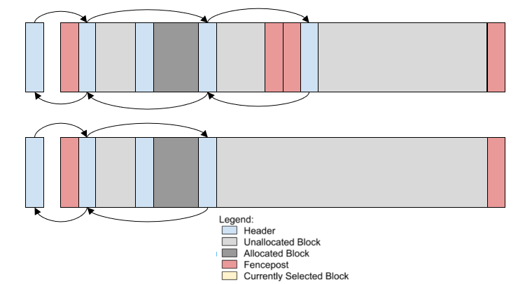
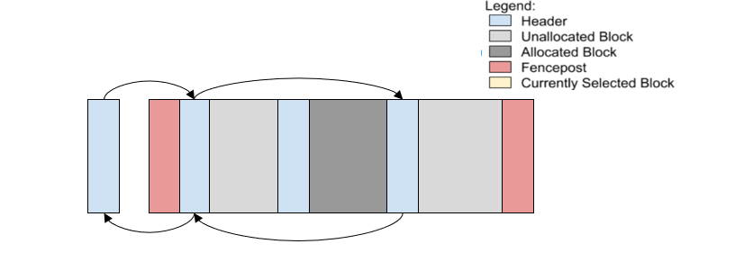
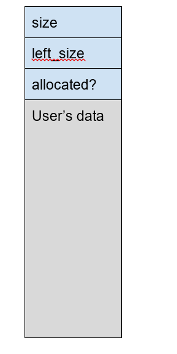

# Overview
This is a simplified version of DLMalloc by Doug Lea

# Functionalities
- **Allocation**
1.	Calculate the required block size (actual request size) by adding the size of the required metadata and rounding the allocation size up to the next 8-byte modulo. The actual request size is either the size calculated in this step or the size of the header struct, whichever is larger.
2.	Find the appropriate free list to look for a block to allocate (recall that the block size per each list is based on the rounded request size, not including the metadata)
a.	As long as there are no blocks in the current list, check the next list until there is a block, which can satisfy the request
b.	When checking the final list, instead of just checking if the list is empty, iterate over all blocks and check if any is large enough to satisfy the request.
3.	Depending on the size of the block, either allocate the full block or split the block and allocate the right (higher in memory) portion to the user.
a.	When splitting, the size and left_size fields maintained in the neighboring blocks will need to be updated.
4.	When allocating a block, update its allocation status to ALLOCATED
5.	Finally, return to the user a pointer to the data field of the header.

- **Deallocation**
1.	Free is called on the same pointer that malloc returned, which means we must calculate the location of the header by pointer arithmetic.
2.	Once we have the header of the block being freed we must calculate the locations of its right and left neighbors, also using pointer arithmetic and the block’s size fields.
3.	Based on the allocation status of the neighboring blocks, we must either insert the block or coalesce with one or both of the neighboring blocks

- **Managing additional chunks**
1.	If no available block can satisfy an allocation request then we must allocate more memory from the OS. To do this we must call sbrk() again.
2.	Two consecutive calls to sbrk() should allocate contiguous regions in memory, therefore when we allocate another chunk we can coalesce it with the most recently allocated chunk. Unfortunately, the user of our library could have called sbrk() between our calls and thus we must check that our two chunks are in fact contiguous in memory.
3.	There are a few cases for managing adding a new chunk to the free lists:
a.	If the new chunk is not adjacent to the previous chunk, then it can simply be inserted into the appropriate free list like any other block.
b.	If the new chunk is adjacent to the previous chunk, then the fence posts between the two chunks should be removed and the chunk should be coalesced with any unallocated memory at the end of the previous chunk.
4.	This process may need to be repeated multiple times to get enough memory to satisfy a user’s requests.

# Data structure
- FreeList: doubly linked list

- List node metadata

